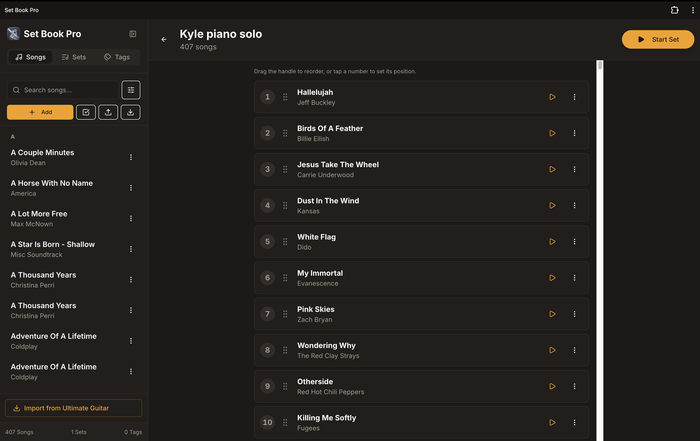
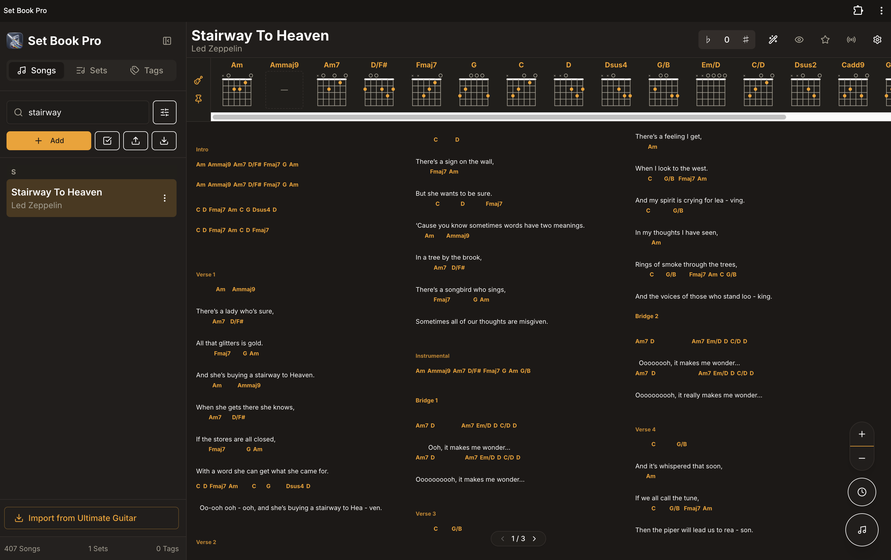
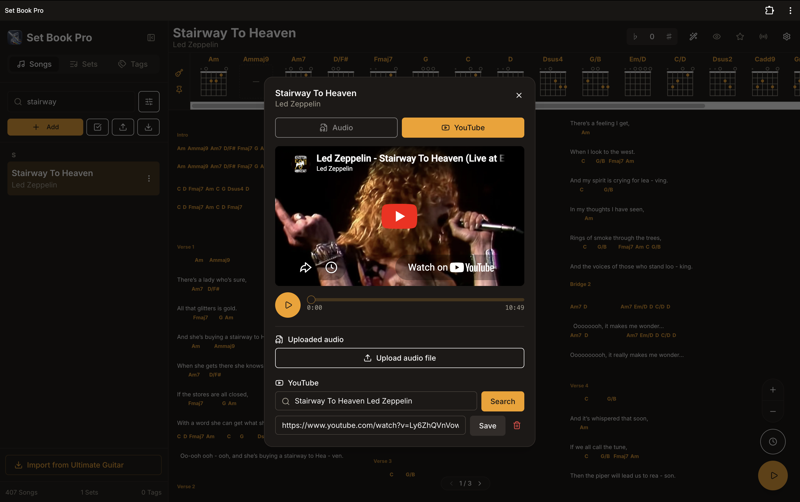
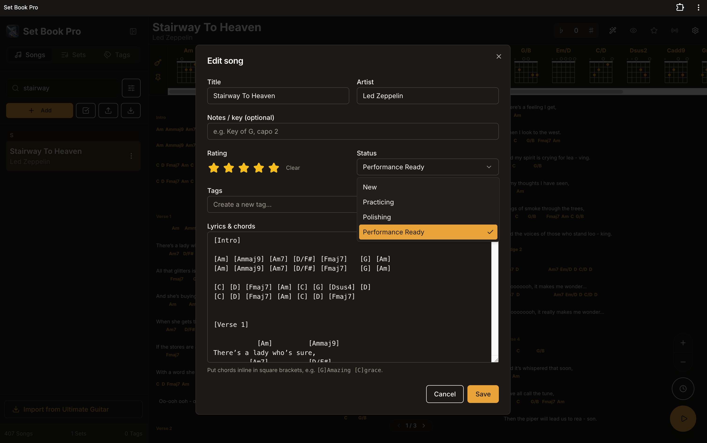

# Set Book Pro

A full-stack Progressive Web App for shared chord/lyrics library management — built for live musicians to view, manage, and sync songs on stage.



## Features

- **Song library** — Store and search songs with chords/lyrics, tags, star ratings and status tracking
- **Chord renderer** — Inline chord diagrams, semitone transposition, scroll/column display modes and auto-scroll
- **Import from Ultimate Guitar** — Search and one-click import tabs directly into your library
- **Sets** — Build ordered set lists and drag to reorder songs
- **Media** — Attach YouTube videos or upload audio files per song
- **Gig sync** — Real-time host/participant sync via WebSockets so the whole band sees the same song
- **Metronome** — Built-in Web Audio API click track
- **PWA** — Installable on iOS and Android





---

> ### ⚠️ Single-password app — not multi-tenant
> Set Book Pro has **no user accounts**. Everyone who accesses your deployment uses the **same shared password** to log in. This is intentional — it's designed for a band or group of musicians who all share one library and set list. You **must** set a strong `APP_PASSWORD` secret before deploying, then share your deployed URL and that password with your bandmates. Do not use a password you use elsewhere.

---

## Deploying on Replit

### 1. Upload the project to Replit

> **Do not use "Fork" or "Import from GitHub"** — upload the zip directly so you get your own fully independent copy.

1. Download this repo as a zip file: click the green **Code** button on GitHub → **Download ZIP**
2. Go to [replit.com](https://replit.com) and click **Create Repl**
3. Choose **Upload** (not a template), and upload the zip file you just downloaded
4. Replit will extract and set up the workspace automatically

---

### 2. Provision a PostgreSQL database

Replit includes a managed PostgreSQL database. To create one:

1. In your Repl, open the **Database** tab in the left sidebar (or go to **Tools → Database**)
2. Click **Create database** — Replit will automatically set the `DATABASE_URL`, `PGHOST`, `PGUSER`, `PGPASSWORD`, `PGDATABASE` and `PGPORT` secrets for you

Then apply the schema by running this SQL in the Database tab's query console (or via the Replit Shell):

```sql
CREATE TABLE IF NOT EXISTS "sets" (
  "id" uuid PRIMARY KEY DEFAULT gen_random_uuid(),
  "title" text NOT NULL,
  "created_at" timestamp with time zone DEFAULT now() NOT NULL
);

CREATE TABLE IF NOT EXISTS "songs" (
  "id" uuid PRIMARY KEY DEFAULT gen_random_uuid(),
  "title" text NOT NULL,
  "artist" text NOT NULL,
  "meta" text,
  "lyrics_chords" text DEFAULT '' NOT NULL,
  "original_ug_id" text,
  "spotify_link" text,
  "created_at" timestamp with time zone DEFAULT now() NOT NULL,
  "media_type" text DEFAULT 'none' NOT NULL,
  "audio_url" text,
  "audio_file_name" text,
  "audio_content_type" text,
  "audio_size" integer,
  "youtube_url" text,
  "rating" integer,
  "status" text DEFAULT 'new' NOT NULL
);

CREATE TABLE IF NOT EXISTS "tags" (
  "id" uuid PRIMARY KEY DEFAULT gen_random_uuid(),
  "name" text NOT NULL,
  "color" text DEFAULT '#6366f1' NOT NULL
);

CREATE TABLE IF NOT EXISTS "set_songs" (
  "set_id" uuid,
  "song_id" uuid,
  "sort_order" integer DEFAULT 0 NOT NULL,
  CONSTRAINT "set_songs_set_id_song_id_pk" PRIMARY KEY("set_id","song_id")
);

CREATE TABLE IF NOT EXISTS "song_tags" (
  "song_id" uuid,
  "tag_id" uuid,
  CONSTRAINT "song_tags_song_id_tag_id_pk" PRIMARY KEY("song_id","tag_id")
);

ALTER TABLE "set_songs" ADD CONSTRAINT "set_songs_set_id_sets_id_fk"
  FOREIGN KEY ("set_id") REFERENCES "sets"("id") ON DELETE CASCADE;
ALTER TABLE "set_songs" ADD CONSTRAINT "set_songs_song_id_songs_id_fk"
  FOREIGN KEY ("song_id") REFERENCES "songs"("id") ON DELETE CASCADE;
ALTER TABLE "song_tags" ADD CONSTRAINT "song_tags_song_id_songs_id_fk"
  FOREIGN KEY ("song_id") REFERENCES "songs"("id") ON DELETE CASCADE;
ALTER TABLE "song_tags" ADD CONSTRAINT "song_tags_tag_id_tags_id_fk"
  FOREIGN KEY ("tag_id") REFERENCES "tags"("id") ON DELETE CASCADE;
```

---

### 3. Create an Object Storage bucket

Audio file uploads require Replit Object Storage:

1. In your Repl, open **Tools → Object Storage**
2. Click **Create bucket** and give it a memorable name (e.g. `MyBucketName`)
3. Inside the bucket, create two folders:
   - `public` — for publicly served assets
   - `.private` — for user-uploaded audio files
4. Copy the bucket name — you'll need it in the next step

---

### 4. Configure secrets

Go to **Tools → Secrets** in your Repl and add the following. Values marked `*required*` must be set before the app will start.

| Secret | Value | Notes |
|--------|-------|-------|
| `APP_PASSWORD` | your chosen password | *required* — the single password to log in to the app |
| `SESSION_SECRET` | a long random string | *required* — used to sign JWTs. Generate one with `openssl rand -base64 64` |
| `DATABASE_URL` | set automatically | Replit sets this when you create the database |
| `DEFAULT_OBJECT_STORAGE_BUCKET_ID` | `MyBucketName` | *required* — the bucket name you created above |
| `PUBLIC_OBJECT_SEARCH_PATHS` | `/MyBucketName/public` | *required* — replace `MyBucketName` with your bucket name |
| `PRIVATE_OBJECT_DIR` | `/MyBucketName/.private` | *required* — replace `MyBucketName` with your bucket name |
| `SPOTIFY_CLIENT_ID` | from Spotify dashboard | optional — enables Spotify link search |
| `SPOTIFY_CLIENT_SECRET` | from Spotify dashboard | optional — enables Spotify link search |
| `FIRECRAWL_API_KEY` | from firecrawl.dev | optional — enables Ultimate Guitar playlist import |

#### Getting a Spotify Client ID & Secret (optional)

1. Go to [developer.spotify.com/dashboard](https://developer.spotify.com/dashboard) and log in
2. Click **Create app**
3. Fill in any name/description, set the redirect URI to `http://localhost`
4. Click **Settings** on your new app to find your **Client ID** and **Client secret**

#### Getting a Firecrawl API key (optional)

Firecrawl is used to scrape Ultimate Guitar shared playlist pages (those behind Cloudflare).

1. Go to [firecrawl.dev](https://www.firecrawl.dev) and create a free account
2. In your dashboard, go to **API Keys** and create a new key
3. Copy the key (starts with `fc-...`) into the `FIRECRAWL_API_KEY` secret

---

### 5. Run the app

Once secrets are configured, click the **Run** button (or use the Shell):

```bash
pnpm install
pnpm run typecheck:libs
```

Replit will start both the API server and the frontend automatically via the configured workflows.

---

### 6. Deploy to production

1. Click **Deploy** in the top right of your Repl
2. Choose **Reserved VM** or **Autoscale** deployment
3. If you have a custom domain, add it under **Deployment settings → Custom domains**
4. Click **Deploy** — Replit builds the frontend and starts the production server

> **Before going live:** change `APP_PASSWORD` and `SESSION_SECRET` to strong, unique values.

---

## Tech stack

| Layer | Technology |
|-------|------------|
| Frontend | React + Vite, Tailwind CSS, Radix UI, Zustand, wouter |
| Backend | Express 5 + Socket.io |
| Database | PostgreSQL + Drizzle ORM |
| Auth | Single-password JWT |
| Storage | Replit Object Storage (Google Cloud Storage) |
| API | Contract-first OpenAPI + Orval codegen |
| PWA | Vite PWA plugin + service worker |

## Development

```bash
# Install dependencies
pnpm install

# Build shared libs
pnpm run typecheck:libs

# Run API server (port 8080)
pnpm --filter @workspace/api-server run dev

# Run frontend (port 21003)
pnpm --filter @workspace/songbook run dev

# Full typecheck
pnpm run typecheck

# After changing the OpenAPI spec
pnpm --filter @workspace/api-spec run codegen
```
